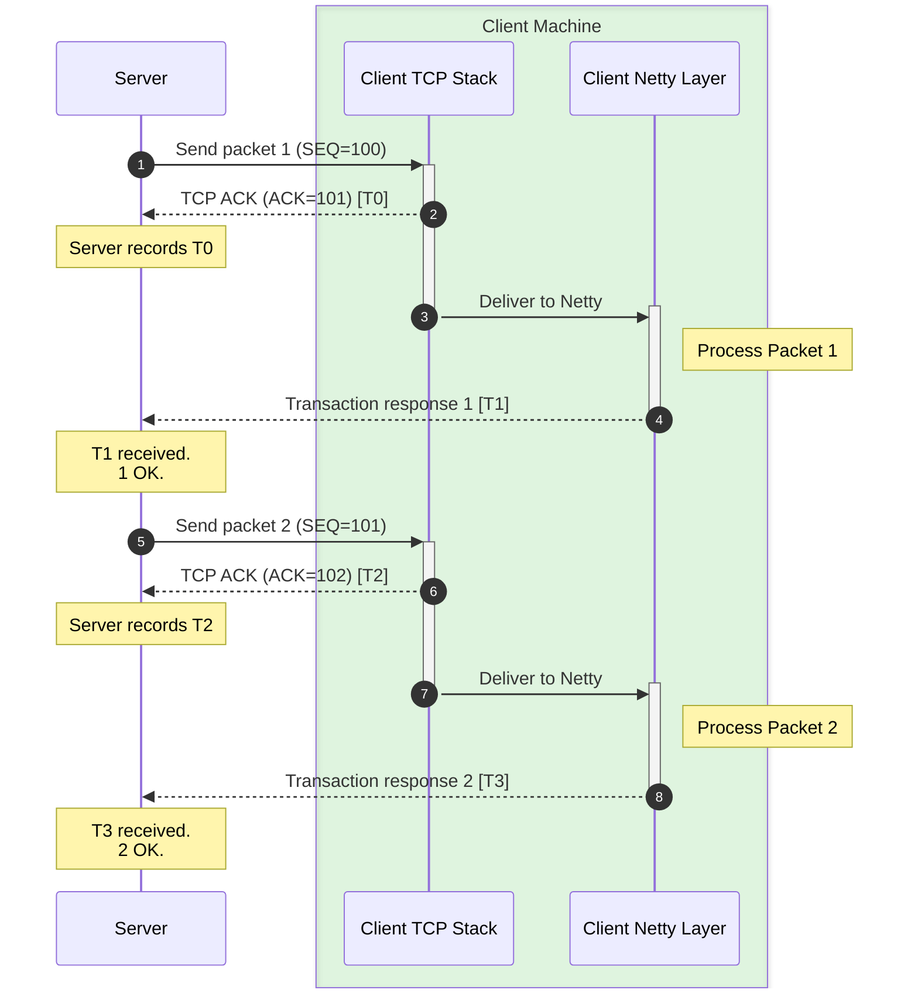
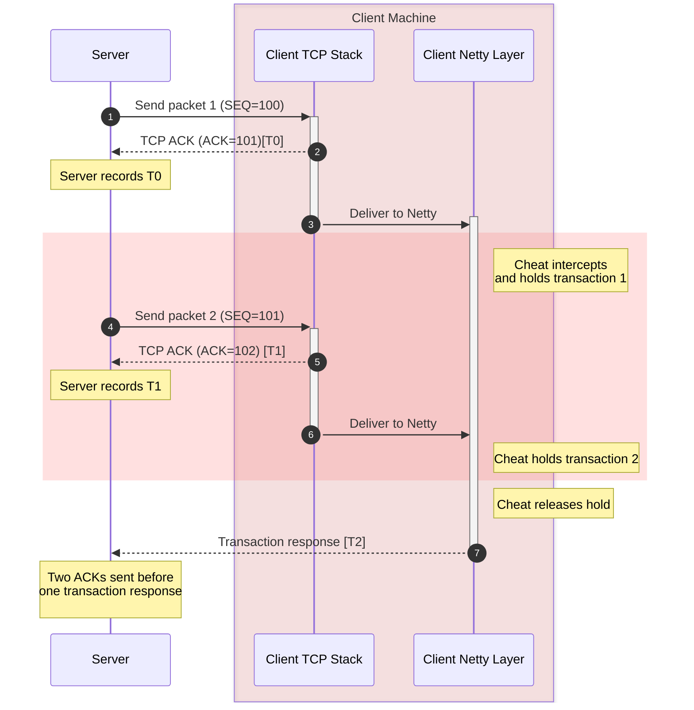

# deterministic-lag-detection-theory
A purely theoretical approach to deterministically detecting lag-based cheats using TCP ACKs (acknowledgements) and transaction (aka ping pong) packets.

# The Problem
Current lag cheat detections mostly relies on heuristics and basic packet order checks, which are often prone to false positives on poor networks or due to a game update. I propose a method that is logically deterministic, making a false positive theoretically impossible.

# The Idea
Minecraft cheats usually rely on intercepting packets at the Netty layer and delaying them until it is convenient to send them. However, this approach has a fundamental flaw: the machine still actually **receives** this data. This means something below the application layer has already processed it.

This is where we enter TCP. At this level, we can get more data about individual packets sent and received across the connection. Specifically, we want to look at ACKs. An ACK is sent by the client or server whenever a packet is received. An ACK consists of an "Acknowledgement Number" and a "Sequence Number," which always correspond to the other side of the connection (e.g., if our client has an ACK of `<num1>`, the server will have a sequence number of `<num1>`).

In a classical TCP connection (without optimizations), these ACKs are **always** sent for every packet **before** the application layer actually handles the data. We can leverage this by using the synchronous blocking nature of transaction packets to ensure that we have properly acknowledged a packet and **sent** a transaction response before receiving the next one.

<table>
<tr>
<th>Normal</th>
<th>Lag Cheat</th>
</tr>
<tr>
<td>

</td>
<td>

</td>
</tr>
</table>

# The Limitations

While this theory is logically sound, it is impractical due to foundational mechanics built into the TCP protocol and modern operating systems: **Delayed** and **Cumulative** Acknowledgments.

### TCP Delayed ACKs ([RFC 1122](https://datatracker.ietf.org/doc/html/rfc1122))
First described in [RFC 813](https://datatracker.ietf.org/doc/html/rfc813) (1982) and officially standardized as a recommended requirement in **[RFC 1122](https://datatracker.ietf.org/doc/html/rfc1122)**, TCP Delayed Acknowledgments were designed to reduce network congestion and overhead. According to the RFC, a receiving host is encouraged *not* to send an immediate ACK for every single data segment it receives.

Since transactions are small, the chances of them being delayed by the OS network stack are very high. Because we do not have control over the client machine, we cannot force the client's OS to disable this (we can't enforce socket options like `TCP_QUICKACK` or `TCP_NODELAY`).

### TCP Cumulative ACKs ([RFC 793](https://datatracker.ietf.org/doc/html/rfc793))
Compounding the issue of delayed ACKs is the fundamental nature of TCP itself, defined in the original TCP specification: **[RFC 793 (Section 1.5)](https://datatracker.ietf.org/doc/html/rfc793#section-1.5)**.

TCP does not acknowledge individual packets; it acknowledges a continuous stream of bytes. [RFC 793](https://datatracker.ietf.org/doc/html/rfc793) establishes that *"the acknowledgment mechanism employed is cumulative so that an acknowledgment of sequence number X indicates that all octets up to but not including X have been received."*

Because of this cumulative design, if the server sends Packet 1 and Packet 2 in quick succession, the client's TCP stack will likely swallow the ACK for Packet 1 and simply send back a single ACK for Packet 2. This single cumulative ACK validates the receipt of both packets simultaneously. This completely breaks the strict 1:1 `Packet -> ACK` tracking required by the deterministic logic in the diagrams, as the server has no way of knowing if the client artificially held the transaction, or if the client's kernel simply grouped the acknowledgment of multiple transaction bytes together.

(However, one can technically make an educated guess by calculating the delta between ACKs to see which of our packets were acknowledged within them, though this loses the "deterministic" certainty).
